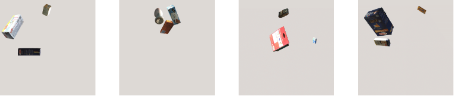

# Track4:Enhancing Retail Checkout through Video Inpainting, YOLOv8 Detection, and DeepSort Tracking (Retail Counter)

This project includes our solution for Track 4 of the [2023 AI City Challenge](http://https://www.aicitychallenge.org/), 
Welcome to the RetailCounter GitHub repository, where we present our sophisticated deep learning-based framework that 
can recognize, localize, track, and count products as they traverse in front of a camera. The retail industry has been 
experiencing an upswing in the use of cutting-edge artificial intelligence and computer vision techniques. 
Among the major challenges in this domain is the development of an automated checkout system that can address the 
multifaceted issues that arise in real-world checkout scenarios. Our proposed framework, RetailCounter, is founded on 
a detect-then-track paradigm, and we apply tracking on the bounding box of the detected objects. In addition, we have 
integrated an automatic identification of the detection region of interest (ROI) and efficient removal of unwanted 
objects from the ROI. Our framework's performance is competitive, as evidenced by our F1 score of 0.8177 and the 
fourth-place ranking we achieved in track 4 of the 2023 AI City Challenge.


Link to downlaod our paper [download](http://davidanastasiu.net/)

## Environment setup

```bash
conda create --name aic23 python=3.9.0
conda activate aic23
conda install pytorch==1.7.1 torchvision==0.8.2 torchaudio==0.7.2 cudatoolkit=11.0 -c pytorch
git clone https://github.com/davidanastasiu/kndar.git
cd retailcounter
python -m pip install -r requirements.txt
cd ..
```
**Note**: for newer devices, such as the NVIDIA RTX 3090, you may use Pytorch 1.10 with cudatoolkit 11.3.

## Dataset
Download the track 4 dataset from the [2023 AI City Challenge](http://https://www.aicitychallenge.org/). 


## Reproduce results with pre-trained detector
### Prepare testing dataset
If you do not want to train detector, You can download pretrain model from
[here](https://drive.google.com/file/d/1VheHPe_CrfjNKYTv1BauhItZkiJ5qa_m/view?usp=share_link) and Dataset
can be in ``AIC23_Track4_TestA.zip`` (or TestB) is sufficient.

```bash
export TRACK_4_DATA_ROOT={/path/to/track_4/root_dir}
```

For example: ``export TRACK_4_DATA_ROOT=/mnt/data/AIC22_Track4_TestA/Test_A``

### Download pre-trained model
```bash
cd retailcounter
python download_pretrained_models.py --detector
```

Alternatively, you may [train detector at your own](#training-ref)

### Removing Outliers
Run:
To create Video Inpainting follow the steps from the GitHub repo mentioned below
```bash
git clone https://github.com/MCG-NKU/E2FGVI
python inpainting_process.py --video_id $TRACK_4_DATA_ROOT/video_id.txt
```

``video_id.txt`` file is available in ``AIC22_Track4_TestA`` and contain video IDs and video file names (in the same directory)

### Automatic ROI Detection
Run:
```bash
python detect_ROI.py --video_id $TRACK_4_DATA_ROOT/video_id.txt
```
Arguments ``--roi_seed`` can be set (two values) - it specifies seed position for ROI detection (white tray) in format ``x y``

### Detect products and create submission
Run:
```bash
python detect_and_create_submission.py --video_id $TRACK_4_DATA_ROOT/video_id.txt
```

Parameters ``--tracker`` and ``--img_size`` can be set. The values are pre-set to ``tracker = BYTE, img_size = 640``

### Hint
All scripts are set as the result was reported to _AI City Challenge_ and no arguments must be set (only ``--video_id``).


## Train object detector for store checkout<a name="training-ref"></a>

### Prepare _AI City Challenge_ dataset<a name="prepare-dataset-ref"></a>
If you want to train detector prepare data at least from Track1, Track3, and Track4 (_AI City Challenge 2022_)  


#### Transform data structure - separate data by classes
```bash
cd retailcounter
cp split_data.sh Track4/Train_SynData/segmentation_labels/split_data.sh
cd Track4/Train_SynData/segmentation_labels
bash split_data.sh

cd retailcounter
cp split_data.sh Track4/Train_SynData/syn_image_train/split_data.sh
cd Track4/Train_SynData/syn_image_train
bash split_data.sh
```
### Train detector (can take many hours/several days)
1. Download pretrained-model models without detector  
```bash
python download_pretrained_models.py
```
2. Prepare _AI City Challenge_ dataset as [described above](#prepare-dataset-ref)
3. Create dataset
```bash
python create_dataset.py --t_4_track {/path/to/AIC_Track4/Train_SynData}
```

4. Train detector
In order to train the detector you need to follow this GitHub repo of YOLOV8 mentioned below

```bash
YOLOV8
git clone https://github.com/ultralytics/ultralytics
YOLOX
python train_detector.py  
```


Arguments ``--batch_size`` and ``--epochs`` can be set. Explicit values are ``batch_size = 16, epochs = 75``.


## Acknowledgements
* Instance segmentation: [MMdetection](https://github.com/open-mmlab/mmdetection)
* Inpainting: [VideoInpainting](https://github.com/MCG-NKU/E2FGVI)
* Detector: [YOLOX](https://github.com/Megvii-BaseDetection/YOLOX), [YOLOV8](https://github.com/ultralytics/ultralytics)
* Trackers: [SORT](https://github.com/abewley/sort), [DEEPSORT](https://github.com/nwojke/deep_sort)

## Citation

If you found our work useful, please cite our paper:

```bibtex
@inproceedings{vats-aic23,
   author    = {Arpita Vats and David C. Anastasiu},
   title     = {Enhancing Retail Checkout through Video Inpainting, YOLOv8 Detection, and DeepSort Tracking},
   volume    = {1},
   month     = {July},
   booktitle = {2023 IEEE Conference on Computer Vision and Pattern Recognition Workshops},
   series    = {CVPRW'23},
   year      = {2023},
   pages     = {},
   location  = {Vancouver, Canada}
}
```

